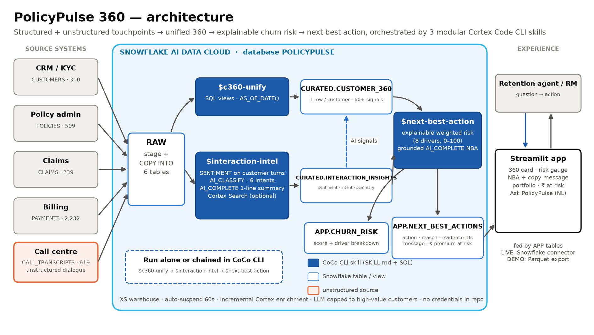

# PolicyPulse 360 🛡️
**Insurance Customer 360 + Next Best Action copilot, built on Snowflake with Cortex Code CLI skills**

Team **Neural Mavericks** · Snowflake CoCo CLI Hackathon (GCC Edition) · Challenge: *Customer 360 and Next Best Action*

| | |
|---|---|
| 🚀 **Live app: Streamlit** (no login) | [neural-mavericks-policypulse360.streamlit.app](https://neural-mavericks-policypulse360.streamlit.app/) |
| 🌐 **Command Center (React)** | [yugrajmangate-dev.github.io/neural-mavericks-policypulse360](https://yugrajmangate-dev.github.io/neural-mavericks-policypulse360/) |
| 🎬 **Demo video** | `<VIDEO_URL>` |
| 📑 **Deck (PDF, official template)** | [`submission/PolicyPulse360_NeuralMavericks_Template.pdf`](submission/PolicyPulse360_NeuralMavericks_Template.pdf) |
| 📝 **Brief** | [`submission/brief.txt`](submission/brief.txt) |

---

## The problem
Indian insurers keep **policy admin, claims, billing and the call centre** in separate systems. Before a renewal call, a retention agent
opens four or more screens and replays recordings. The strongest churn signals (*"I want to port my policy"*, *"claim pending 45 days"*,
*"an aggregator quoted ₹4,000 less"*) sit in **unstructured call transcripts** that nobody reads at scale. Churn gets discovered at lapse.

**PolicyPulse 360** unifies structured and unstructured touchpoints into one 360 view in Snowflake. It scores churn risk explainably
and recommends the **next best action**: the action, the reason, cited call evidence and a ready-to-send customer message. The agent goes from a question
to an action in one screen.

## Architecture


Mermaid source: [`submission/architecture.mmd`](submission/architecture.mmd)

## The four Cortex Code CLI skills
Skills live in [`.cortex/skills/`](.cortex/skills), so CoCo CLI loads them automatically when started from the repo root. Each one is a
`SKILL.md` plus SQL, **runnable alone or chained**. They share Snowflake tables as their contract.

| Skill | Input | Snowflake / Cortex | Output |
|---|---|---|---|
| [`$c360-unify`](.cortex/skills/c360-unify/SKILL.md) | RAW customers, policies, claims, payments, transcripts | SQL views, `AS_OF_DATE()` | `CURATED.CUSTOMER_360` (1 row per customer, 60+ signals) |
| [`$interaction-intel`](.cortex/skills/interaction-intel/SKILL.md) | `RAW.CALL_TRANSCRIPTS` (unstructured) | `SNOWFLAKE.CORTEX.SENTIMENT` (customer turns), `AI_CLASSIFY` (6 intents), `AI_COMPLETE` (1-line summary), optional **Cortex Search** | `CURATED.INTERACTION_INSIGHTS` (incremental) |
| [`$next-best-action`](.cortex/skills/next-best-action/SKILL.md) | 360 + insights | explainable weighted risk (8 drivers, 0–100) + grounded `AI_COMPLETE` | `APP.CHURN_RISK`, `APP.NEXT_BEST_ACTIONS` (action · reason · evidence IDs · message) |
| [`$ask-policypulse`](.cortex/skills/ask-policypulse/SKILL.md) | any plain-English retention question | **PolicyPulse Copilot** Cortex Agent: Cortex Analyst on the semantic view `APP.CUSTOMER_360_SV` + Cortex Search on transcripts | cited answer (`[T0xxxx]` transcript IDs) + recommended action |

Chain: `$c360-unify` → `$interaction-intel` → `$next-best-action`, then ask anything with `$ask-policypulse`. The exact on-camera prompts are in [DEMO_SCRIPT.md](DEMO_SCRIPT.md).

**Write-back action log:** recommendations aren't fire-and-forget. An agent's decision on a next best action (✅ Accepted / ✖️ Rejected / 🏁 Done, plus a note) is recorded in `APP.ACTION_LOG`. That happens from the Streamlit app in LIVE mode, or when `$ask-policypulse` offers to log it. `APP.ACTION_UPTAKE` then shows which plays agents trust. Deployed by `python scripts/run_upgrades.py` together with the semantic view, Cortex Search service and Copilot agent.

### Results: real Cortex run (hackathon account, AWS us-west-2)
| Metric | Value |
|---|---|
| Customers flagged High risk | **67 of 300 (22%)** |
| Recall of truly at-risk customers (hidden synthetic label) | **81%**, at **91% precision** |
| Annual premium in the High-risk band | **₹32.9 L of ₹1.45 Cr (23%)** |
| High-risk renewals due within 30 days | **41** |
| Transcripts enriched by Cortex (SENTIMENT · AI_CLASSIFY · AI_COMPLETE) | **819** |
| Next best actions written by **GPT-4.1 via Cortex `AI_COMPLETE`** | **150** (High/Medium risk + upsell signals; the rest use the rule engine) |

Numbers are measured on the seeded synthetic dataset. AI_CLASSIFY matched 100% of the intent labels, which is inflated because the transcripts are template-generated.

### Explainable churn score
| Driver | Max | Rule |
|---|---|---|
| Negative sentiment | 25 | 25 × clamp((0.25 − avg customer sentiment 90d) / 1.0, 0, 1) |
| Cancellation / porting intent | 20 | call in last 90d (8 if 91–180d) |
| Price sensitivity | 10 | price-concern call in last 90d |
| Payment stress | 15 | 15 × min(1, (late + 2 × missed, 12m) / 4) |
| Claim friction | 15 | 15 × min(1, (slow/open >30d + rejected) / 2) |
| Renewal proximity | 15 | ≤30d: 15 · ≤60d: 10 · ≤90d: 5 |
| Tenure ≥ 8y / recent praise | −5 each | protective |

Bands: **High ≥ 55**, **Medium 30–54**, **Low < 30**.

## The app
`streamlit_app.py` has four tabs:
- **Customer 360 + NBA**: search, profile, risk gauge with driver breakdown, next best action with evidence and a copyable message, a call timeline with AI summaries, the sentiment trend, and policies, claims and payments
- **Portfolio**: ₹ premium at risk, premium by product × risk band, intent × sentiment, the 90-day renewal pipeline, recommended plays, and a call list
- **Ask PolicyPulse**: plain-English questions (*"Which health policyholders renewing next month are at high churn risk and why?"*)
- **How it works**

The app runs in two modes:
- **DEMO MODE** (default, no secrets): reads `demo_data/*.parquet`, which are pipeline outputs exported from Snowflake. Judges need no login.
- **LIVE MODE** (Snowflake secrets present): queries `POLICYPULSE` directly, regenerates an NBA on demand with Cortex, and answers questions with Cortex text-to-SQL (read-only, allow-listed).

> The demo badge tells you where the data came from. A yellow badge means the offline simulation of the Cortex pipeline
> ([`scripts/simulate_pipeline_local.py`](scripts/simulate_pipeline_local.py)). A blue badge means real Cortex outputs exported by
> [`scripts/export_demo_data.py`](scripts/export_demo_data.py).

## Setup (5 commands)
Prerequisites: Python 3.10+, a Snowflake account with Cortex, and [Cortex Code CLI](https://docs.snowflake.com/user-guide/cortex-code/cortex-code-cli).
For Windows, install CoCo with `irm https://ai.snowflake.com/static/cc-scripts/install.ps1 | iex`. For macOS or Linux, use
`curl -LsS https://ai.snowflake.com/static/cc-scripts/install.sh | sh`.

```bash
pip install -r requirements.txt
python data/generate_data.py              # seeded synthetic Indian insurance data -> data/raw/
python scripts/load_to_snowflake.py       # XS warehouse, DB POLICYPULSE, RAW/CURATED/APP, load tables
cortex                                    # then: $c360-unify -> $interaction-intel -> $next-best-action
python scripts/export_demo_data.py && streamlit run streamlit_app.py
```
To run without CoCo (CI or warm-up), use `python scripts/run_pipeline.py`. Add `--fallback` for legacy Cortex functions.

The Snowflake connection is read from `~/.snowflake/connections.toml`, the same file used by CoCo and the Snowflake CLI:
```toml
default_connection_name = "policypulse"

[policypulse]
account   = "<account_identifier>"
user      = "<user>"
password  = "<password>"          # or authenticator = "externalbrowser"
role      = "ACCOUNTADMIN"        # or a role with CREATE DATABASE / WAREHOUSE + SNOWFLAKE.CORTEX_USER
warehouse = "POLICYPULSE_WH"
```

## Deploy for judges (Streamlit Community Cloud)
1. Push this repo to GitHub as a **public** repo.
2. At [share.streamlit.io](https://share.streamlit.io), create an app from your repo with branch `main` and main file `streamlit_app.py`.
3. Leave the secrets **empty** for DEMO mode. For LIVE mode, paste [`.streamlit/secrets.toml.example`](.streamlit/secrets.toml.example) with real values under *Advanced settings → Secrets*.
4. Deploy, then paste the URL into the table at the top of this README.

## Cost and safety
- XS warehouse with `AUTO_SUSPEND = 60`. Skill 1 makes no Cortex calls. Skill 2 is incremental (only new transcripts). The Skill 3 LLM is capped at 150 high-value customers.
- No credentials in the repo: `.gitignore` covers `secrets.toml`, `connections.toml`, keys and `.env`.
- All data is synthetic, for the fictional *Kavach Insurance*.
- Decisions and fallbacks are logged in [ASSUMPTIONS.md](ASSUMPTIONS.md).

## Repo map
```
.cortex/skills/        4 CoCo skills (SKILL.md + SQL): c360-unify · interaction-intel · next-best-action · ask-policypulse
sql/                   setup + load · upgrades: semantic view, Cortex Search, Copilot agent, ACTION_LOG write-back
data/                  seeded generator + raw CSVs (+ eval labels)
scripts/               load · run_pipeline · run_upgrades · export_demo_data · export_web_data · simulate_pipeline_local · fill_template · render_architecture · build_deck
app/                   data layer (demo/live) + Ask engine
streamlit_app.py       the Streamlit app
web/                   React Command Center (GitHub Pages)
demo_data/             Parquet the public app reads
submission/            brief · deck · architecture · video script
```
